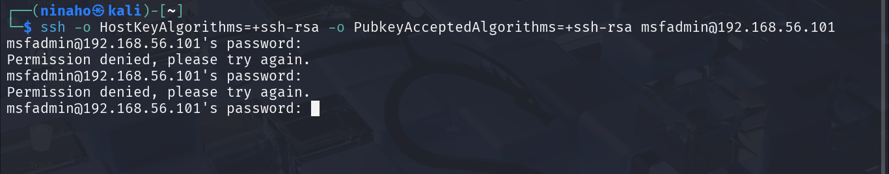
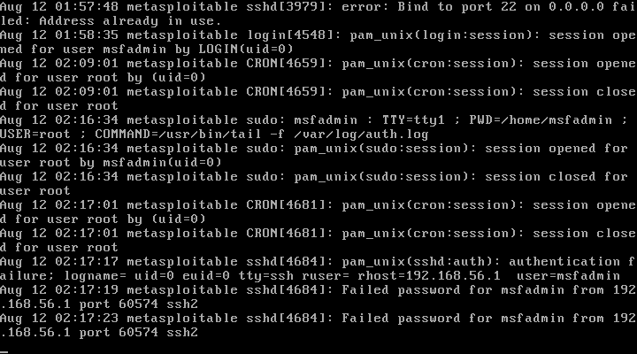
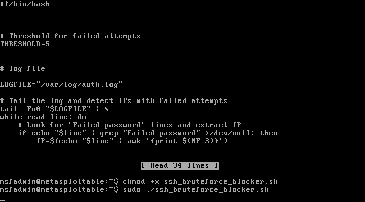
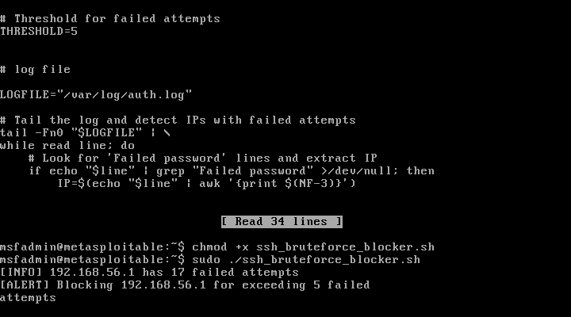
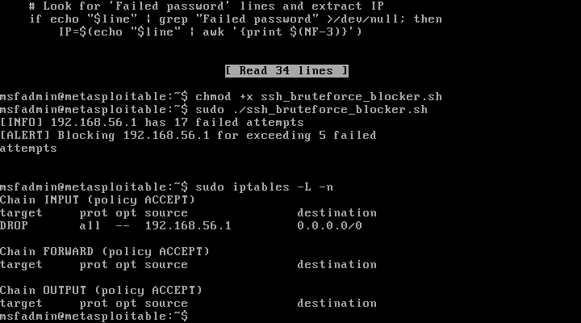

# SSH Brute-Force Detection & Blocking with Bash in Metasploitable2 VM

## Project Overview

This lab demostrates how to detect failed SSH login attempts in real-time and automatically block the offending IP address using a Bash script and iptables.

It simulates real-world intrusion detection and prevention.

## Objectives

- Learn how to monitor SSH authentication logs (/var/log/auth.log)
- Automate detection of repeated failed login attempts.
- Automatically block attackers using firewall rules.
- Test the automation using Kali Linux VM as an attack machine.

## Lab Setup

Environment:

- Host OS: Windows (Oracle VirtualBox)

- Attacker VM: Kali Linux

- Target VM: Metasploitable2 VM

- Network: Host-Only Adapter

Tools:

- ssh

- nano (text editor)

- iptables (firewall)

- Bash scripting

## Steps taken

1. Network & Connectivity
2. Enabling SSH on Metasploitable2
3. Live Log Monitoring
4. Creating Detection Script & Making it Executable
5. Testing the Attack
6. Verify Block
7. Unblock Script

### Step 1: Network & Connectivity

Verified connectivity with ping from Kali Linux VM to Metasploitable2 VM which shown a successful ping test with 0% packet loss.

### Step 2: Enable SSH on Metasploitable2 VM

To allow remote connections from the Kali Linux attack machine, the SSH service had to be enabled on the Metasploitable2 target system. Metasploitable2 ships with OpenSSH installed but not always running by default.

In Metasploitable2 terminal, I started the SSH service using the init script:

```
sudo /etc/init.d/sshd start
```
After enabling SSH, I then verified the service status:

```
ps aux | grep sshd`
```

The outcome listed the sshd process, which means that SSH is active and ready to accept connections.

### Step 3: Live Log Monitoring in Metasploitable2 VM

Modern SSH clients such as Kali's OpenSSH disable weak algorithms by default, and refuse to connect to Metasploitable2's old SSH server, which only supports ssh-rsa and ssh-dss key exchange algorithms. This is common with old vulnerable VMs like Metasploiable2.

For this reason, the older algorithms needed to be explicitly allowed in the SSH command to allow for a successful connection.

In Kali terminal, the following command was executed:

```
ssh -o HostKeyAlgorithms=+ssh-rsa -o PubkeyAcceptedAlgorithms=+ssh-rsa msfadmin@192.168.56.101
```

The command above is an SSH connection to the Metasploitable2 VM with compatibility options added so modern Kali SSH client can connect to its outdated SSH server. 

I then generated failed password attempts manually using ssh with the old algorithm enabled as shown below:



*Screenshot on establishing SSH connection and generating Metasploitable2 failed password attempts in Kali*

I confirmed if the failed password attempt logs were reaching Metasploitable2 by executing:

```
sudo tail -f /var/log/auth.log
```

As in the screenshot below, at the very bottom, we can see failed password attempts logs in Metasploitable2's /var/log/auth.log:



*Screenshot of Metasploitable2 failed password attempts logs*

### Step 4: Creating Bash Script To Detect Brute-Force Attempts

The objective here is continuously watch for logs in /var/log/auth.log to spot repeated failed login attempts from the same IP address and block that IP automaticatically.

```
nano ssh_bruteforce_blocker.sh
```

```
#!/bin/bash

# Threshold for failed attempts
THRESHOLD=5

# Log file
LOGFILE="/var/log/auth.log"

# Tail the log and detect IPs with failed attempts
tail -Fn0 "$LOGFILE" | \
while read line; do
    # Look for 'Failed password' lines and extract IP
    if echo "$line" | grep "Failed password" >/dev/null; then
        IP=$(echo "$line" | awk '{print $(NF-3)}')
        
        # Count how many times this IP has failed recently
        COUNT=$(grep "Failed password" "$LOGFILE" | grep "$IP" | wc -l)
        
        echo "[INFO] $IP has $COUNT failed attempts"
        
        # If count exceeds threshold, block with iptables
        if [ "$COUNT" -ge "$THRESHOLD" ]; then
            echo "[ALERT] Blocking $IP for exceeding $THRESHOLD failed attempts"
            sudo iptables -A INPUT -s "$IP" -j DROP
        fi
    fi
done
```

Saved as ssh_bruteforce_blocker.sh

To execute the script and make it usable, I ran the following commands in Metasploitable2:

```
chmod +x ssh_bruteforce_blocker.sh
```

```
sudo ./ssh_bruteforce_blocker.sh
```



*Screenshot of the bruteforce blocker script and making it executable*

The script was thereafter actively monitoring the logs.

### Step 5 — Brute-force attack simulation

To simulate the brute-force attack from Kali, multiple incorrect SSH logins were tried. The command below was first executed to establish a SSH connection to the Metasploitable2 VM:

```
ssh -o HostKeyAlgorithms=+ssh-rsa -o PubkeyAcceptedAlgorithms=+ssh-rsa msfadmin@192.168.56.101
```

I proceeded to enter a wrong password 6+ times.

I then checked for the respective failed password attempts logs in Metasploitable2.



*Screenshot of failed password attempts and blocked Kali IP in Metasploitable2*

From the above screenshot, I observed script detecting 17 failed attempts and blocking Kali IP address 192.168.56.1

To verify the blocked Kali IP in Metasloitable2, the command below was executed: 

```
sudo iptables -L -n
```



*Screenshot on verifying blocked Kali IP in Metasploitable2*

From the ouput above, we can see a rule: DROP       all  --  192.168.56.1        0.0.0.0/0 

